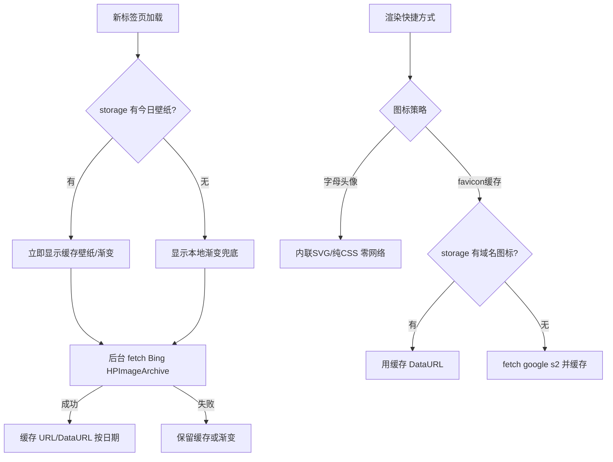
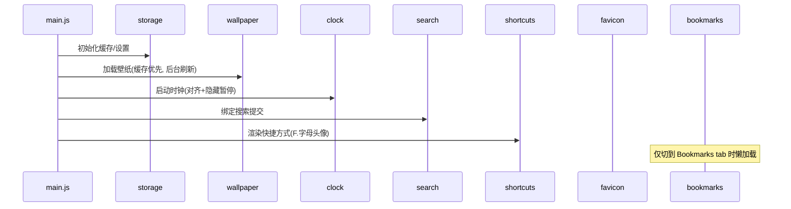

# Edge 新标签页扩展 · 优化方案（架构师高见远）

> 范围说明：本文档仅做**方案与设计**，不改动任何代码。所有改动以「原生、零运行时框架、低占用」为前提，与团队默认栈（React+MUI+Tailwind）的取舍结论见 §1.1。
> 分析依据：已亲自通读 `manifest.json` / `newtab.html`(99 行) / `newtab.css`(373 行) / `newtab.js`(425 行)。

---

## 0. 一句话结论

**维持纯原生三件套（HTML + CSS + 原生 JS），不引入任何运行时框架；用「削减叠加模糊 + 壁纸/图标本地缓存 + 时钟对齐暂停 + 可选 esbuild 仅压缩」四板斧，把 GPU/网络/CPU 占用压到最低，同时把单文件拆成可维护的若干模块。** 这是同时满足「简洁 / 高效 / 快速 / 低占用 / 美观」的唯一不矛盾路径。

---

## 1. 现状架构评估

### 1.1 技术选型评价：维持原生 vs 引入框架

| 维度 | 现状（纯原生、零构建） | 若按团队默认栈（Vite+React+MUI+Tailwind） |
|------|------------------------|-------------------------------------------|
| 运行时体积 | 0（无框架） | React(~45KB gz) + MUI(~100KB+ gz) + Tailwind utils，合计 150KB+ gz |
| 首屏 JS 执行 | 极少（425 行原生，无 reconciler） | 框架引导 + 首次 render + 虚拟 DOM diff |
| 交互开销 | 直接 DOM 操作 | 每次状态变更走 scheduler/reconciler |
| 内存/合成层 | 取决于 CSS（见 §1.3） | 框架本身常驻 + 更多节点 |
| 离线/隐私 | 可控（仅 Bing 壁纸外链） | 同左，但体积更大 |
| 构建复杂度 | 无 | 需构建链 |

**结论：维持原生，不引入框架。** 理由：

1. 新标签页是**每次开新标签都加载**的页面，运行时占用的边际成本被反复放大——框架的常驻开销与每次交互的 reconciler 计算，与「低占用 / 快速」诉求**直接冲突**。
2. 当前纯原生已是**最低体积路径**：3 个静态文件、零依赖、无构建膨胀，首屏 JS 执行极少。
3. 框架带来的「可维护性」收益，可用「**适度模块拆分（仍原生，可选 esbuild 仅做拼接压缩）**」替代，而不付出任何运行时代价。

> 一句话：框架解决的是「大型应用的状态与组件复用」问题，而本页面是**单页、近静态、无复杂状态**，框架在此是净负担。

### 1.2 现有实现的亮点 ✅

- 纯静态、零依赖、零构建 → 最快加载、最低占用。
- `prefers-color-scheme` 暗/明自动适配（CSS 变量切换）。
- 书签树**懒加载**（仅切到 Bookmarks tab 才请求 `chrome.bookmarks`）。
- `escapeHtml` 防 XSS；图标 `onerror` 回退字母；`loading="lazy"`。
- 键盘快捷键（`/` 聚焦搜索、`Esc` 关闭弹窗）。
- 拖拽排序 + 4 种尺寸 + 自定义图标上传/裁剪，功能完整。
- 壁纸加载失败时回退 CSS 渐变。
- JS 置于 `<body>` 末尾，不阻塞 HTML 解析。

### 1.3 现有实现的隐患 ⚠️

| 隐患 | 影响诉求 | 说明 |
|------|----------|------|
| **大量叠加 `backdrop-filter: blur()`** | 低占用 / 高效 / 美观 | overlay(1px) + 搜索框(12px) + 标签栏/设置按钮(8px) + **每个快捷方式卡片(8px)** + 弹窗(4px)。尤其是「每张快捷方式卡片都 blur(8px) 叠在壁纸+遮罩之上」是 **GPU 合成最大开销点**：N 个卡片 = N 个独立模糊区域，集显/移动端/低端机会掉帧、升温、耗电。 |
| **Bing 壁纸每次 `fetch` 且无缓存** | 快速 / 低占用 / 离线 | 强依赖网络；离线/失败仅回退渐变（体验断崖），且每次都浪费一次网络往返。 |
| **favicon 走 `google.com/s2/favicons` 外链** | 低占用 / 快速 / 隐私 | 每个快捷方式 + 每个书签都是一次网络请求，含隐私与单点依赖风险，且未缓存（N 链接 = N 请求）。 |
| **时钟 `setInterval(10s)` 隐藏时不停** | 高效 / 低占用 | 页面隐藏（切走标签）仍运行；且仅显示 HH:MM 却每 10s 重绘，可对齐到分钟 + 隐藏暂停。 |
| **单文件 425 行 JS** | 简洁 / 可维护 | 低占用但可维护性一般；拆多文件会增加请求数——但**扩展本地文件请求近乎零成本**，收益 > 代价。 |
| **无障碍缺失** | 美观 / 可访问性 | 缺 `role="tab"`/`aria-selected`；无 `:focus-visible` 焦点环；未处理 `prefers-reduced-motion`；部分壁纸下文字对比度不足。 |
| **base64 图标存 `localStorage`** | 低占用 / 可维护 | 多自定义图标会逼近 5MB 上限；localStorage 同步读写，quota 小、incognito 不共享。 |
| **无手动主题/壁纸开关/引擎切换** | 简洁 / 美观 | 仅跟随系统；壁纸不可关；搜索硬编码 Bing。 |

---

## 2. 针对五个诉求的优化机会清单

> 诉求缩写：① 简洁　② 高效　③ 快速　④ 低占用　⑤ 美观

| # | 诉求 | 优化点 | 具体做法 | 预期收益 | 改动文件 | 风险 |
|---|------|--------|----------|----------|----------|------|
| **O1** | ④低占用/②高效/⑤美观 | 削减叠加模糊 | 快捷方式卡片**去掉** `backdrop-filter`，改半透明纯色；搜索框/标签栏 blur 降到 4–6px；overlay 去 blur 或仅 0.5px；弹窗 blur 降到 2–3px | GPU 合成层与重绘大减，集显更稳、动效更顺 | `newtab.css` | 视觉从「毛玻璃」变「半透明」，需用户接受（见 §6-Q1） |
| **O2** | ③快速/④低占用/离线 | 壁纸缓存 | 缓存壁纸 URL（及可选缩略 DataURL）到 `chrome.storage.local`，按日期键；**首屏先显缓存**，后台静默刷新；失败用缓存或本地渐变 | 首屏即出图、离线可用、省网络 | `newtab.js`、`manifest`（加 `storage`） | 需新增 `storage` 权限（极小） |
| **O3** | ④低占用/③快速/隐私 | favicon 去外链 | 默认用**字母头像**（内联 SVG/纯 CSS，零网络）；可选「开联网取 favicon 并缓存到 `chrome.storage.local`」 | 零外链请求、离线可用、无隐私泄露 | `newtab.js`、`newtab.css` | 默认无真实站点图标，需用户接受（§6-Q5） |
| **O4** | ②高效/④低占用 | 时钟对齐+暂停 | 计算到下一分钟的对齐定时器；`visibilitychange` 隐藏时 `clearInterval`，可见时重启并立即校正 | 隐藏标签零 CPU、减少无谓重绘 | `newtab.js` | 极低 |
| **O5** | ①简洁/可维护 | 模块拆分（无框架） | 将 `newtab.js` 拆为 `clock/search/shortcuts/bookmarks/wallpaper/favicon/settings` 等模块；用 **esbuild 仅拼接+压缩**产出单文件 | 可维护性↑，产物仍单文件最小 | `newtab.js`→`src/*`、新增 `build.mjs` | 引入构建（仅压缩，无 runtime） |
| **O6** | ⑤美观/无障碍 | 动效与焦点 | 加 `@media (prefers-reduced-motion: reduce)` 关闭动画；加 `:focus-visible` 焦点环；tab 加 ARIA role/aria-selected | 动效克制优雅、键盘可达 | `newtab.css`、`newtab.html`、`newtab.js` | 低 |
| **O7** | ④低占用/可维护 | 存储迁移 | 快捷方式（含图标）从 `localStorage` 迁到 `chrome.storage.local`；对 base64 图标限尺寸/压缩 | 避免 quota 爆、支持更大缓存、incognito 共享 | `newtab.js`、`manifest` | 需 `storage` 权限；少量异步改造 |
| **O8** | ①简洁 | 图标裁剪精简 | 评估是否保留：保留则**去 canvas**，改「直接传方形图 + CSS 圆角/遮罩 + 缩放预览」；或完全移除 | 降低复杂度与代码量 | `newtab.js`、`newtab.html`、`newtab.css` | 需用户拍板（§6-Q1） |
| **O9** | ①简洁/⑤美观 | 设置增强 | 设置弹窗增加：主题手动切换（明/暗/跟随）、壁纸开关、搜索引擎选择 | 可控性↑，断网也能用 | `newtab.html`、`newtab.css`、`newtab.js`、`manifest` | 中等，需用户拍板（§6-Q2/3/4） |
| **O10** | ④低占用 | 权限收紧 | 若壁纸可关 → `host_permissions` 可条件移除；`storage` 仅在用缓存时加 | 最小权限面 | `manifest.json` | 依赖 O2/O9 决策 |

**补充发现（除上述外）：**

- **首屏图标 `loading="lazy"` 无效且可能延迟**：首屏可见的快捷方式图标本就在视口内，lazy 不会加速、反而可能延后。建议首屏图标用默认（或 `eager`），仅书签树内深层图标用 lazy。
- **合成层内存**：`backdrop-filter` 会自动提升为合成层。O1 削减后层数量下降，内存占用同步下降。
- **拖拽已实现 compositor-friendly**：拖拽态用 `transform/opacity`（合成属性）而非重排，这点做得好，保留。
- **`will-change` 不要滥用**：当前未用，保持。
- **对比度**：壁纸 + 仅 0.35 遮罩在亮色壁纸下文字对比度可能不足 → 可随 O1 适度加深 overlay 或加 `text-shadow`（时钟已有）。
- **`<html lang="zh-CN">` 但内容多为英文**：非功能性，可改为 `en` 或保留；属可访问性细节。

---

## 3. 技术栈与构建建议

### 3.1 运行时框架
**不引入。** 维持原生 DOM API。理由见 §1.1。框架用于解决本页面不存在的「复杂状态/组件复用」问题。

### 3.2 构建工具（仅压缩/拼接，零运行时依赖）
**推荐引入轻量构建：esbuild。**

- **开发期**：拆成 `src/*.js` 多模块，可读、可维护、可测试。
- **发布期**：`esbuild src/main.js --bundle --minify --outfile=newtab.js` → 产出**单文件、最小体积、无 runtime**。
- CSS 可保留单文件手工维护，或用 `lightningcss`/esbuild 顺带压缩（可选）。
- **绝不引入** Vite+React+Tailwind 运行时。

**权衡（体积 vs 可维护性）——esbuild 同时达成两者**：源码拆分带来可维护性，构建产出仍是最小单文件，服务「简洁」与「快速/低占用」。

### 3.3 资源配置 / 权限

| 权限 | 现状 | 建议 | 说明 |
|------|------|------|------|
| `bookmarks` | ✅ 有 | 保留 | 书签功能依赖 |
| `storage` | ❌ 无 | **新增** | 壁纸/图标缓存、设置持久化（体积小、必要） |
| `host_permissions: https://www.bing.com/*` | ✅ 有 | 保留（若 O9 允许关壁纸，可改为按需/可移除） | 仅壁纸 HPImageArchive 需要 |
| 其他 | — | 不新增 | 维持最小权限面 |

---

## 4. 优先级任务清单（P0 / P1 / P2）

### P0 — 高收益 / 低风险，优先做
| 任务 | 目标诉求 | 做法 | 预期收益 | 改动文件 |
|------|----------|------|----------|----------|
| **T1** | ④低占用/②高效/⑤美观 | O1 削减叠加模糊（卡片去 blur、搜索/标签栏降档） | GPU 合成层与重绘显著下降，集显更稳、动效更顺 | `newtab.css` |
| **T2** | ③快速/离线 | O2 壁纸缓存（按日期）+ 渐变兜底 | 首屏即出图、离线可用、省网络 | `newtab.js`、`manifest`(+storage) |
| **T3** | ④低占用/隐私 | O3 favicon 改字母头像 + 可选缓存 | 去 N 次外链、离线可用 | `newtab.js`、`newtab.css` |
| **T4** | ②高效 | O4 时钟对齐分钟 + 隐藏暂停 | 隐藏标签零 CPU | `newtab.js` |

### P1 — 中收益，提升质量与可维护性
| 任务 | 目标诉求 | 做法 | 预期收益 | 改动文件 |
|------|----------|------|----------|----------|
| **T5** | ①简洁/可维护 | O5 模块拆分 + esbuild 压缩 | 可维护性↑、产物仍最小 | 新增 `src/*`、`build.mjs` |
| **T6** | ⑤美观/无障碍 | O6 动效(reduced-motion)/焦点(focus-visible)/ARIA | 动效克制、键盘可达 | `newtab.css`、`newtab.html`、`newtab.js` |
| **T7** | ④低占用/可维护 | O7 存储迁移 `chrome.storage.local` + 图标限尺寸 | 避免 quota 爆、支持更多图标 | `newtab.js`、`manifest` |

### P2 — 需用户决策 / 锦上添花
| 任务 | 目标诉求 | 做法 | 依赖 |
|------|----------|------|------|
| **T8** | ①简洁/⑤美观 | O9 设置增强（主题/壁纸/引擎） | §6-Q2/3/4 |
| **T9** | ①简洁 | O8 图标裁剪精简/去除 | §6-Q1 |
| **T10** | ④低占用 | O10 权限按功能条件收紧 | 随 T2/T8 落地 |

---

## 5. 目标文件结构 / 改动清单

### 5.1 推荐结构（原生 + esbuild，无运行时框架）

```
qing-newtab/
├── manifest.json            # 增加 "storage" 权限
├── newtab.html              # 增加 ARIA role/tabindex、<meta name="theme-color">
├── newtab.css               # 削减 blur、加 reduced-motion、:focus-visible
├── newtab.js                # 构建产物（由 src 拼接压缩）
├── src/
│   ├── config.js            # 常量、默认快捷方式、搜索引擎表
│   ├── storage.js           # chrome.storage.local 封装（壁纸/图标/设置缓存）
│   ├── clock.js             # 时钟（对齐 + 隐藏暂停）
│   ├── search.js            # 搜索提交（引擎可切换）
│   ├── shortcuts.js         # 快捷方式网格 / 拖拽 / 设置项
│   ├── bookmarks.js         # 书签树懒加载
│   ├── wallpaper.js         # 壁纸缓存 / 渐变兜底
│   ├── favicon.js           # 字母头像 + 可选缓存 favicon
│   ├── settings.js          # 弹窗 / 主题 / 壁纸 / 引擎
│   └── main.js              # 入口，按序初始化
├── icons/
└── build.mjs                # esbuild 脚本（仅压缩拼接，零 runtime）
```

### 5.2 若维持单文件（无构建）的改动点清单
- `newtab.css`：移除 `.shortcut-item` 的 `backdrop-filter`；搜索框/标签栏 blur 降档；`.modal` blur 降档；新增 `reduced-motion` 与 `:focus-visible`。
- `newtab.js`：壁纸缓存逻辑；favicon 字母头像；时钟对齐 + 暂停；存储迁移（`localStorage`→`chrome.storage.local` 异步）；设置项增强（主题/壁纸/引擎，可选）。
- `manifest.json`：加 `storage` 权限。
- `newtab.html`：tab 按钮加 `role="tab"` / `aria-selected`，面板加 `role="tabpanel"`；加 `<meta name="theme-color">` 与 `color-scheme` meta。

---

## 6. 待与用户确认的问题（需拍板）

1. **图标裁剪功能是否保留？** 保留则建议简化为「直接传方形图 + CSS 圆角/遮罩 + 缩放预览」，去除 canvas 裁剪；或完全移除（更贴合「简洁」）。
2. **壁纸是否允许联网获取？** 若允许，是否接受「缓存到本地、离线用缓存/渐变」？若不允许，是否改用纯本地渐变/纯色？
3. **是否需要明暗色「手动切换」**（覆盖系统 `prefers-color-scheme`）？
4. **搜索引擎是否可切换**（Bing / Google / 自定义）？还是维持 Bing？
5. **快捷方式图标默认策略**：接受「字母头像」（无真实站点图标、零网络）？还是默认仍取 favicon（联网）但加缓存？
6. **是否接受引入 esbuild 作为「仅压缩/拼接」构建**（开发多文件、发布单文件）？还是坚持零构建、单文件手写？
7. **是否把快捷方式存储从 `localStorage` 迁到 `chrome.storage.local`**（更大 quota、支持更多自定义图标、incognito 共享）？

---

## 附录 A · 壁纸 + favicon 缓存数据流



## 附录 B · 模块初始化 / 调用流


